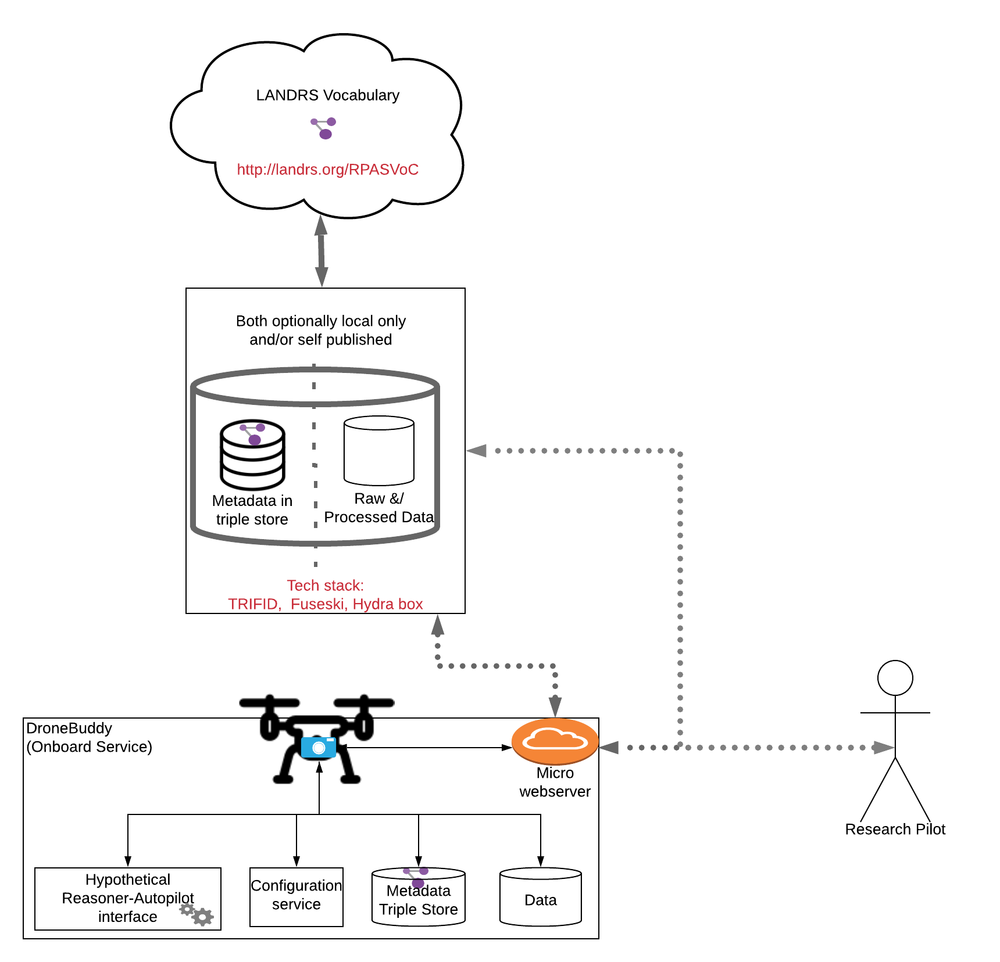

# DroneDataBuddy
On board service to annotate, archive, and publish data as linked data onboard a companion computer

**Status:** This repo is currently just for design discussion and development.  Code dev will begin January 2020

User Stories are outlined in:
* [Drone Developer](DDesignUserStories/DroneDeveloper_UserStories.md)
* [Pilot/Project PI](DesignUserStories/Pilot_UserStories.md)
* [Researchers](DesignUserStories/Researcher_UserStories.md)

