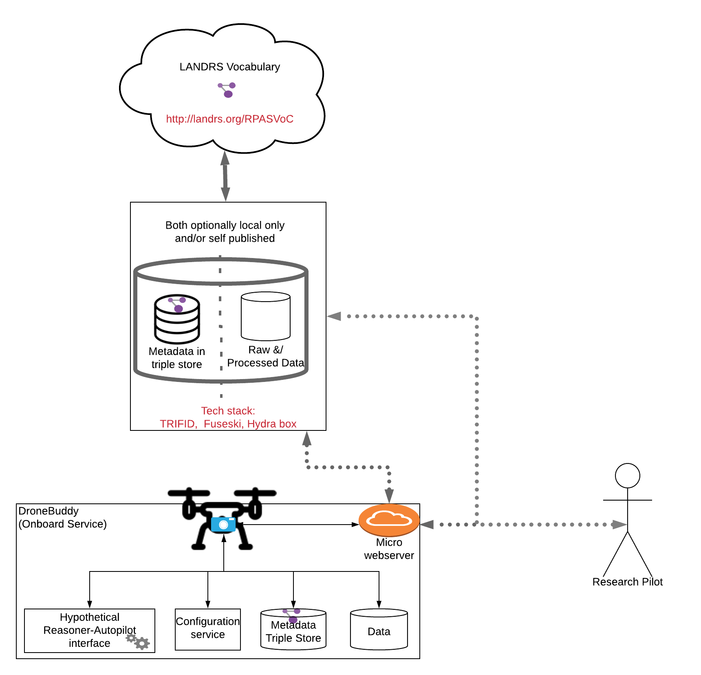

# DroneDataBuddy
On board service to annotate, archive, and publish data as linked data onboard a companion computer

**Status:** This repo contains code that is being developed to deploy what was previously known as TOAST via Balena on a Pi4

User Stories are outlined in:
* [Drone Developer](DroneDeveloper_UserStories.md)
* [Pilot/Project PI](Pilot_UserStories.md)
* [Researchers](Researcher_UserStories.md)

